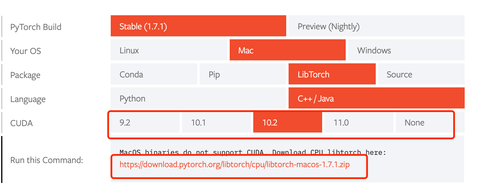

# pytorch的cpp后端

用c++实现pytorch的examples

- 记得到[https://pytorch.org/get-started/locally/](https://pytorch.org/get-started/locally/)下载 torchlib到本地，获得目录
  
- 然后给`CMakeLists.txt` 里面 `set(Torch_DIR /path/xxx/libtorch/share/cmake/Torch)`